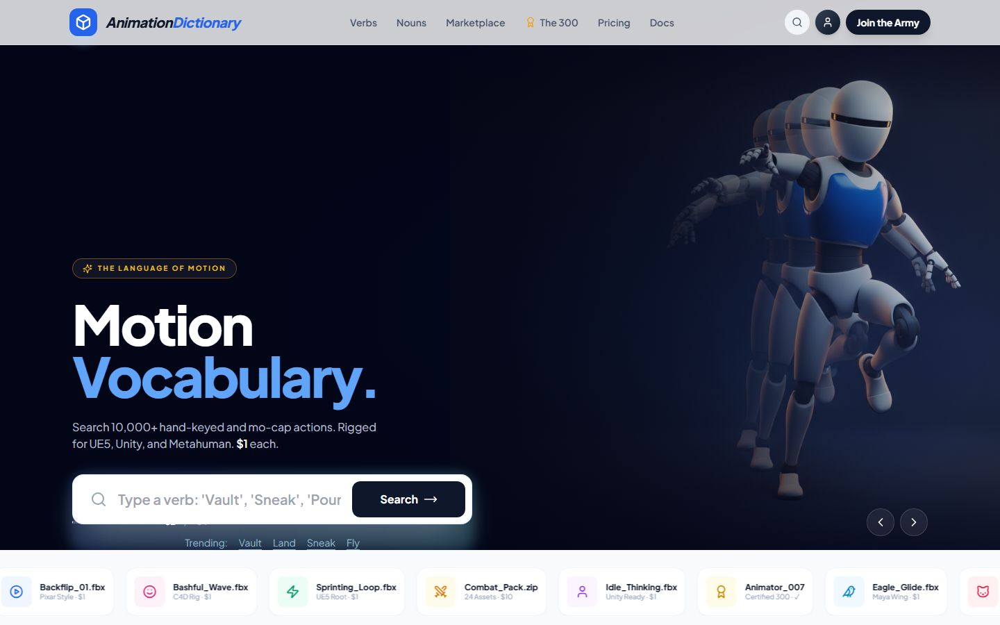
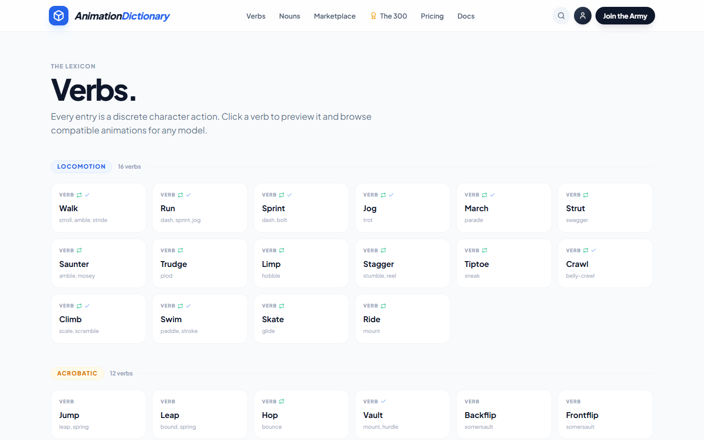
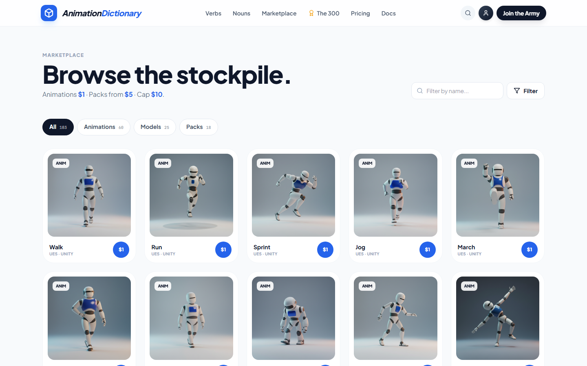
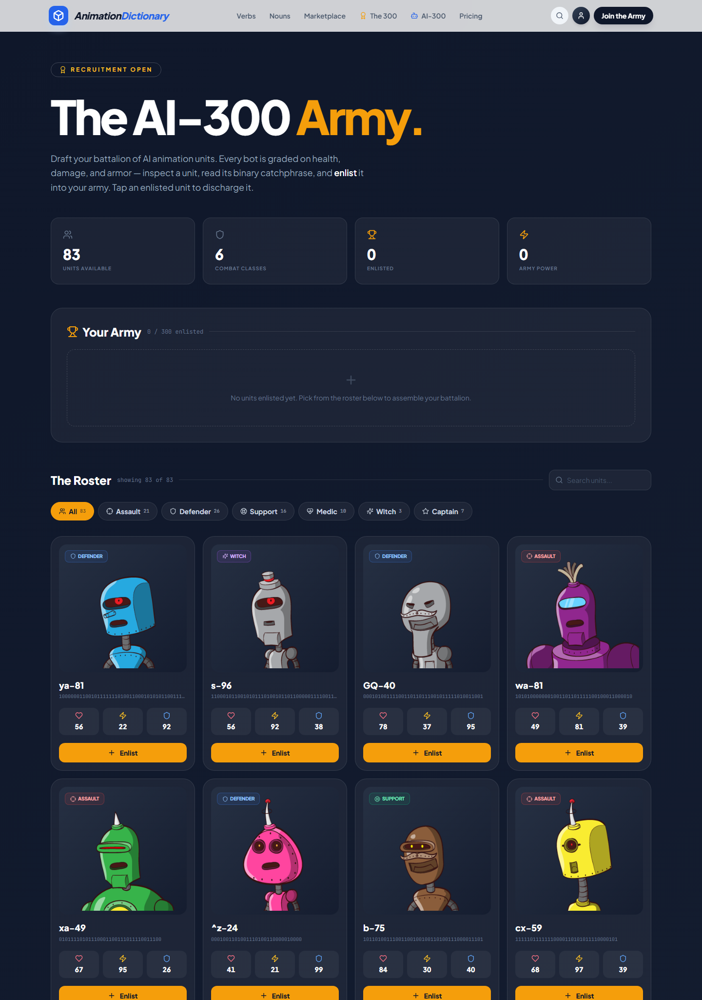

# animationdictionary.xyz

> **The Language of Motion** — a semantic marketplace for 3D animations and rigged
> character models. Search by *verb*, browse by *noun*, buy at **$1 / animation**
> with packs capped at **$10**. Curated by the hand-picked **Animation 300**.

<p align="center">
  <a href="https://animationdictionary.xyz"><strong>Live site → animationdictionary.xyz</strong></a>
</p>

---

## Screenshots

### Hero — "Motion Vocabulary"
A four-slide auto-rotating hero featuring the recurring "barracks robot" rig, a
live verb search, and a scrolling motion ticker.



### Verbs — the lexicon of actions
Every animation is indexed as a **verb** (an action) and grouped by category
(Locomotion, Acrobatic, Combat, …). Click any verb to preview it on the 3D
viewer and find compatible models.



### Marketplace — browse the stockpile
A client-filterable grid of animations, models, and packs. Same rig across every
card so cross-asset comparisons stay apples-to-apples. Flat **$1** pricing.



---

## What's inside

A statically-exported **Next.js 14** site with a small, opinionated design
system. The whole catalogue is mock data today (no backend), which keeps the
build a pure static export that any host — including IIS — can serve.

| Area | What it does |
| --- | --- |
| **Landing** (`/`) | Hero slideshow, robot showcase, lexicon teaser, marketplace + Animation 300 previews |
| **Verbs** (`/verbs`, `/verbs/[verb]`) | 84 actions grouped by category; detail page with 3D viewer, paired models, and listings |
| **Nouns** (`/nouns`, `/nouns/[noun]`) | 76 rigged characters; detail page with an animation picker |
| **Marketplace** (`/marketplace`) | Client-side filter/search grid over ~100 items |
| **Animation 300** (`/animation-300`) | The dark "barracks" roster of elite, certified animators |
| **AI-300 Army** (`/ai300`) | Interactive recruiter — draft a battalion of AI animation bots (see below) |

## Tech stack

- **Next.js 14** (app router) — static export (`output: 'export'`, `trailingSlash: true`)
- **Tailwind CSS** with **Plus Jakarta Sans** (UI) + **JetBrains Mono** (technical text)
- **react-three-fiber / drei** — placeholder 3D viewer (swap for rigged `.glb` later)
- **lucide-react** — icon set
- AI-generated imagery via the **magi** skill (Google Gemini `gemini-2.5-flash-image`)

## Project structure

```
app/
  page.tsx                 # landing
  verbs/page.tsx           # all verbs, grouped by category
  verbs/[verb]/page.tsx    # detail (3D viewer + paired models + listings)
  nouns/page.tsx           # all nouns, grouped by category
  nouns/[noun]/page.tsx    # detail (3D viewer + animation picker)
  marketplace/page.tsx     # client-filterable grid
  animation-300/page.tsx   # the "barracks" dark-themed roster
  ai300/                   # interactive "AI-300 Army" recruiter (client)
components/
  nav.tsx, footer.tsx
  hero-slideshow.tsx       # 4-slide auto-rotating hero (client)
  motion-ribbon.tsx        # scrolling top ticker
  asset-card.tsx           # marketplace product card
  search-bar.tsx           # hero search w/ verb+noun lookup (client)
  viewer.tsx               # Three.js placeholder
data/
  verbs.ts (84), nouns.ts (76), animators.ts (30), marketplace.ts (~100), ai300.ts
docs/screenshots/          # README imagery
magi.style*.txt            # locked style anchors for image generation
magi-shotlist*.json        # prompt batches passed to the magi skill
build-deploy.ps1           # one-shot build + deploy to IIS wwwroot
```

## The AI-300 Army (`/ai300`)

The interactive companion to the Animation 300 roster: a **bot-battalion
recruiter** ported from the classic *Bot Battlr* exercise and re-skinned to the
site's barracks theme.



Browse a roster of 83 AI animation units across six combat classes (Assault,
Defender, Support, Medic, Witch, Captain), filter and search the roster, inspect
each unit's class, binary catchphrase, and combat stats (health / damage /
armor), then **enlist** them into your army — and discharge any unit with a
click. All state is client-side, so it ships happily inside the static export.

Highlights:

- Per-class iconography and accent colours (`lucide-react`)
- Live class filter chips + name search
- "Your Army" panel with running unit count and total **Army Power**
- Click-to-inspect modal with animated stat bars
- Roster data generated from the original `db.json` into a typed `data/ai300.ts`

## Local development

```bash
npm install
npm run dev    # http://localhost:3000
```

## Production build + deploy (Windows / IIS)

```powershell
# from the repo root:
.\build-deploy.ps1
```

This runs `next build` (static export → `out/`), mirrors the output into
`C:\inetpub\wwwroot\animationdictionary.xyz\`, fixes ACLs for `IIS_IUSRS`, and
runs a host-header smoke test against every route. The IIS site is bound to
`*:80:animationdictionary.xyz` + `*:80:www.animationdictionary.xyz` (plus a
per-site internal port).

## Generating imagery

Requires `$env:GEMINI_API_KEY`. The **magi** skill lives at
`~/.claude/skills/magi/`. From the repo root:

```powershell
& "$env:USERPROFILE\.claude\skills\magi\scripts\magi.ps1" `
  -Shotlist .\magi-shotlist-verbs-batch2.json `
  -OutDir   .\public\img\verbs `
  -StyleFile .\magi.style.txt
```

The style anchor is appended to every prompt in a batch so all images from one
run feel cohesive (a single recurring robot rig, consistent lighting, etc.).

## Roadmap

- [ ] WebP conversion (homepage PNGs are heavy)
- [ ] Mobile nav menu (`lg:` links currently hide below the breakpoint)
- [ ] Real `.glb` rigged models in the 3D viewer
- [ ] Auth (Google OAuth via NextAuth)
- [ ] Uploads + Stripe payments
- [ ] AI video-to-animation pipeline

## License

All rights reserved © animationdictionary.xyz. Mock catalogue data and
AI-generated imagery are for demonstration purposes.
